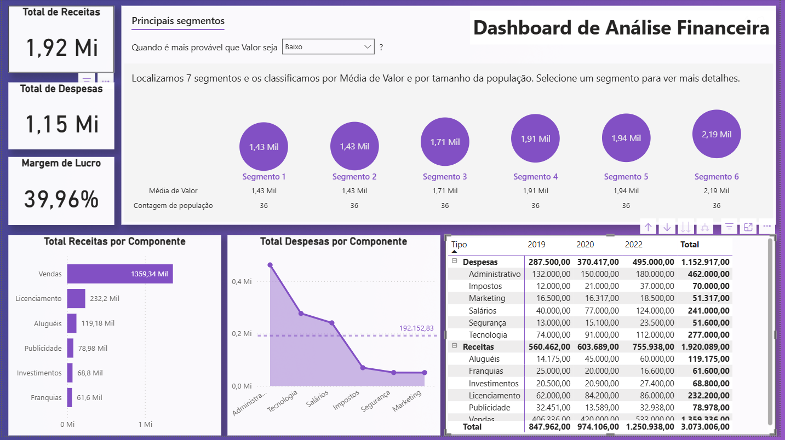

# 📊 Dashboard de Análise Financeira

Este projeto tem como objetivo fornecer uma visão clara e interativa sobre os principais indicadores financeiros da empresa, por meio de um **Dashboard de Análise Financeira** desenvolvido no **Power BI**.

A ferramenta foi criada para apoiar a **tomada de decisões estratégicas**, permitindo à empresa visualizar, comparar e analisar dados financeiros com facilidade.

---

## 🎯 Objetivos do Projeto

A empresa solicitou a criação de um painel que permitisse acompanhar e analisar os seguintes indicadores financeiros:

✅ **Total de Receitas**  
✅ **Total de Despesas**  
✅ **Margem de Lucro**  
✅ **Total de Receitas por Componente** (Ex: Vendas, Licenciamento, Aluguéis etc.)  
✅ **Total de Despesas por Componente**, com destaque para a **comparação com a média de despesas**  
✅ **Total de Receitas e Despesas por Componente e por Ano**, com uso de **hierarquia Tipo/Componente**

Além disso, a empresa precisava identificar os **segmentos onde**:

- As **Receitas** são **mais altas e mais baixas**  
- As **Despesas** são **mais altas e mais baixas**

Essa análise por segmento é fundamental para o **planejamento estratégico** da organização.

---

## 🧰 Ferramentas Utilizadas

- **Power BI**  
- **DAX (Data Analysis Expressions)** para medidas personalizadas  
- **Modelagem de dados** com hierarquias  
- **Visualizações interativas**

---

## 📸 Visão Geral do Dashboard



---

## 🚀 Como Baixar e Utilizar o Projeto

1. **Clone ou baixe este repositório**:
   - Clique em `Code` > `Download ZIP`
   - Ou clone via Git:
     ```bash
     git clone https://github.com/seu-usuario/seu-repositorio.git
     ```

2. **Abra o arquivo `.pbix` no Power BI Desktop**:
   - Certifique-se de que o Power BI Desktop está instalado.
   - Navegue até o arquivo `DashboardFinanceiro.pbix` e abra-o.

3. **Explore os dados**:
   - Utilize os filtros interativos para explorar diferentes segmentos e períodos.
   - Analise os gráficos e indicadores para obter insights financeiros.


